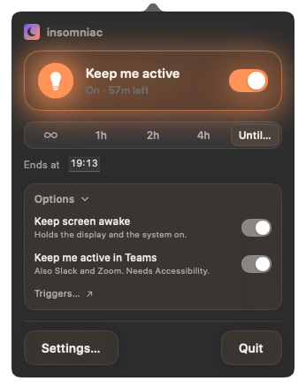
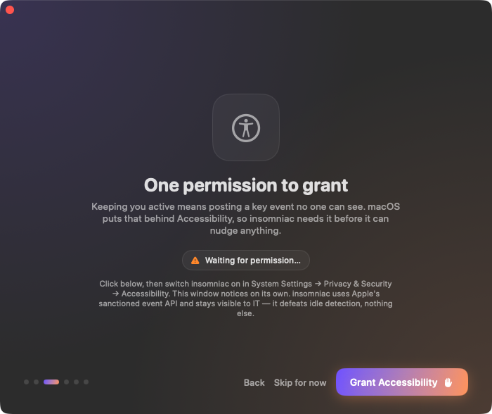
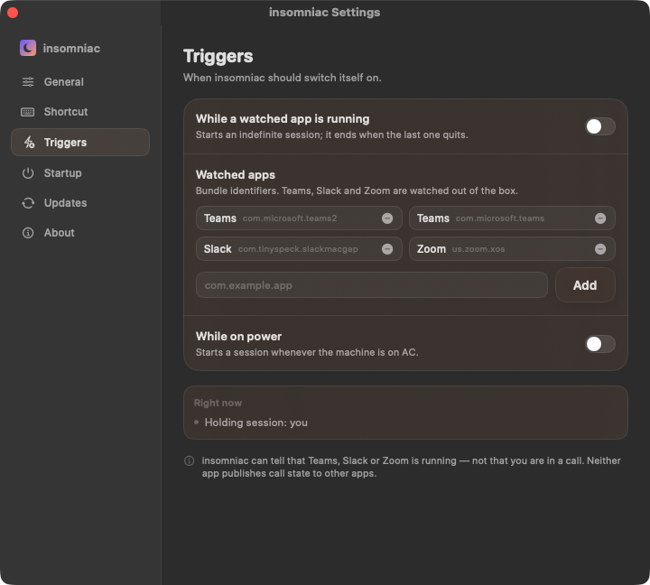

# insomniac

Keeps you **active**, not just awake — on macOS and Windows.

Most "stay awake" tools only assert a power state: your screen stays on, but Microsoft
Teams and Slack still flip you to **Away**, because part of what they publish as presence
is derived from how long it has been since you touched the machine. insomniac keeps that
counter alive.

<p align="center">
  
</p>

## Download

| Platform | File | Where |
| --- | --- | --- |
| **macOS** 14 or later | `insomniac-X.Y.Z.dmg` | [Latest macOS release](https://github.com/MotionComplex/insomniac-releases/releases/latest) |
| **Windows** 10 (version 2004) or later, 64-bit | `insomniac-setup-X.Y.Z.exe` | [All releases](https://github.com/MotionComplex/insomniac-releases/releases) — take the newest **`win-vX.Y.Z`** tag |

macOS and Windows are separate tag series (`vX.Y.Z` and `win-vX.Y.Z`), so GitHub's
"Latest" badge may point at either platform. For Windows, go by the newest `win-v` tag
rather than the badge.

## Installing

### macOS

1. Open the `.dmg` and drag **insomniac** to **Applications**.
2. Launch it from Applications. **macOS blocks it the first time** — see below.
3. A short onboarding runs on first launch.

**Getting past the first-launch block.** insomniac is signed with a self-signed
certificate rather than Apple-notarized, so macOS refuses the first launch. The warning
means "macOS has not seen this developer before," not "macOS found something wrong."

1. Try to open insomniac once, and dismiss the warning.
2. Open **System Settings → Privacy & Security**.
3. Scroll down to **Security**. There is a line saying *"insomniac" was blocked…*
4. Click **Open Anyway** and authenticate with Touch ID or your password.
5. Confirm **Open** in the dialog that follows.

Once per Mac. Notarization is the thing that removes the step, and it is planned.

### Windows

1. Run `insomniac-setup-X.Y.Z.exe`. **SmartScreen warns** — see below.
2. It installs **per user**: no administrator rights, no UAC prompt, into
   `%LocalAppData%\Programs\insomniac`, with one Start-menu shortcut.
3. Launch it from the Start menu. It lives in the notification area (system tray).

**Getting past SmartScreen.** This release is not Authenticode code-signed yet, so Windows
shows *"Windows protected your PC."* That means "unrecognised publisher," not "something
was found." Click **More info**, then **Run anyway**. Code signing is planned; until then
the warning is expected on every fresh machine.

Only one copy runs at a time — launching insomniac again surfaces the running copy's
flyout instead of starting a second.

## Permissions

### macOS — one grant, and only if you want the Active layer

The **Awake** layer, which keeps the display and system from sleeping, needs no permission
at all. If that is all you want, insomniac never prompts you for anything.

The **Active** layer posts an invisible key event, and macOS puts that behind
**Accessibility**:

<p align="center">
  
</p>

1. In onboarding, click **Grant Accessibility** — or, later, switch on **Keep me active in
   Teams** under the panel's **Options**. Either one raises the system prompt.
2. In that prompt, click **Open System Settings**.
3. System Settings opens at **Privacy & Security → Accessibility**. Find **insomniac** in
   the list and switch it **on**.
4. That's all — **no need to quit and relaunch**. insomniac re-checks twice a second, so
   the onboarding window or the panel picks the grant up about a second after you flip the
   toggle.

If insomniac is not in the Accessibility list at all, click **+**, choose it from
**Applications**, and switch it on.

You can revoke the grant in the same place at any time. insomniac reads it fresh on every
check rather than caching it, so revoking takes effect immediately: the panel switches to
**Accessibility needed** instead of continuing to claim the layer is working.

### Windows — none

Neither layer needs a permission grant. The Active layer uses `SendInput` and the Awake
layer a named power request; neither requires elevation or raises a prompt, so first-run
onboarding asks for nothing. Launch-at-startup writes a single value under
`HKCU\Software\Microsoft\Windows\CurrentVersion\Run`, also without elevation.

## Why "active" and not just "awake"

Teams and Slack don't know whether you're working. They know how long it's been since you
touched the keyboard, and part of what they publish as presence is derived from that.
Usually that's a fine guess. Sometimes it isn't:

- A build, test suite, export, or long query is running and you're watching it finish.
- You're reading something on paper, or on a separate device your machine can't see.
- You're at a colleague's desk or a whiteboard in the same room.

In each of those you're working and generating no input, and after a few minutes the
indicator reports otherwise. insomniac keeps the idle counter alive so it stops reporting
an absence nobody observed.

**What it doesn't do.** It keeps a status green. It doesn't read your messages, answer
anything, or attend your meetings, and anyone working with you will notice the difference
in about the time it takes to send you one. It changes only the idle-derived part of
presence — not a status you set by hand, not "In a meeting" from your calendar, not "In a
call" when you're actually in one, and not presence coming from your phone or another
device signed into the same account. Lock your machine and Teams shows you Away, session
or no session.

Whether running it on a machine your employer manages is appropriate is between you and
your employer.

## What you get

- **A menu-bar panel** (macOS) or **tray flyout** (Windows): one toggle, a session
  countdown, and the two layers inline.
- **A global shortcut** — **⌃⌥⌘I** on macOS, rebindable on both platforms — to start or
  stop a session from anywhere.
- **Sessions that end themselves** after a length you pick, or run indefinitely.
- **Triggers**: switch on automatically while Teams, Slack or Zoom is running, or while the
  machine is on power.
- **Launch at login**, and in-app updates.

### Triggers

<p align="center">
  
</p>

Triggers are edge-driven. A trigger-owned session runs indefinitely and ends when the
trigger goes false; ending a session by hand does not restart it until the trigger falls
and rises again, and a trigger never ends a session you started yourself.

As the pane itself says: **insomniac can tell that Teams, Slack or Zoom is running — not
that you are in a call.** Neither app publishes call state to other apps. An "only while
I'm in a call" trigger is therefore **parked, not shipped**: on macOS there is no
sanctioned way to read call or screen-sharing state without a Screen Recording grant, and
insomniac is not going to take one for a convenience feature.

## How it works

Two layers, switched independently.

| Layer | Keeps | How | Permission |
| --- | --- | --- | --- |
| **Active** (the point of the app) | the idle counter Teams, Slack and Zoom read | posts one invisible input event on an interval | macOS: Accessibility · Windows: none |
| **Awake** | the display and system from sleeping | a standard power assertion | none |

The event is an **F15 key press** by default. F15 is absent from modern keyboards and has
no default binding, so nothing on screen responds to it. The alternative is a **zero-delta
mouse move**, sent to the cursor's current position — so the pointer does not move either.
Nothing on screen jumps in either case.

Underneath: on macOS the nudge goes through `CGEventPost` and resets `HIDIdleTime`; on
Windows through `SendInput`, resetting the counter `GetLastInputInfo` reports. Chromium
derives idle from those same counters, which is what Slack, new Teams and Zoom's Electron
and WebView2 surfaces read. The Awake layer is an `IOPMAssertion` on macOS and a named
`PowerCreateRequest` on Windows — the latter listed by name in `powercfg /requests`.

Because the nudge resets the **display** idle timer too, a session that only keeps you
active still keeps the screen on. The Awake layer adds the assertion that holds the whole
machine out of idle sleep. Closing the lid still sleeps a Mac.

insomniac never swaps mechanisms on its own. An engine that quietly retried with the other
one would hide the case where neither works — so if the chosen mechanism is being dropped,
insomniac reports it rather than showing you a green light that means nothing.

## Troubleshooting

**Teams still shows me as Away.** Check the panel first: if it says **Accessibility
needed**, the grant is missing or was revoked (macOS only — see Permissions above). If the
session is running and the layer looks healthy, the cause is something insomniac does not
touch: a status you set by hand, a calendar entry, Do Not Disturb, a locked machine, or
presence coming from Teams on your phone.

**My machine is locked.** Teams and Slack show you Away while a machine is locked, whatever
runs in the background. insomniac does not touch the lock screen and will not unlock
anything for you. It does keep the machine from **auto-locking on idle** during a session,
because that is the same timer the Active layer resets — but a lock you or a policy trigger
by hand still locks.

**I granted Accessibility on a managed Mac and it still doesn't work.** A corporate
configuration profile can grant Accessibility while separately withholding event posting.
insomniac tells those two apart and will keep saying it cannot nudge, because it cannot.
That policy is your IT department's to change.

**The nudge doesn't seem to land.** Switch mechanisms by hand. On macOS:

```bash
defaults write com.motioncomplex.insomniac nudgeMechanism nullMouseMove   # or f15Key
```

Quit and relaunch insomniac afterwards — the value is read at startup and never re-read.
On Windows, set `"nudgeMechanism"` to `"nullMouseMove"` (or `"f15Key"`) in
`%APPDATA%\insomniac\settings.json` while insomniac is not running.

**How often does it nudge?** Every 120 seconds by default, comfortably under the idle
thresholds these apps use. Change it in **Settings → General**.

## Updates

On **macOS**, insomniac updates itself through [Sparkle](https://sparkle-project.org): it
checks this repo's `appcast.xml` about once a day and offers the new version when there is
one. On **Windows** it does the same through WinSparkle against `appcast-windows.xml`. On
both, you can check on demand from **Settings → Updates → Check for Updates…**.

Every update is signed with an EdDSA key and the signature is **required** — an archive
that does not verify against the key baked into your installed copy is refused, not
installed.

## Privacy and honesty

- **No telemetry.** insomniac collects nothing, stores nothing about you off your machine,
  and has no analytics of any kind. Your settings live in your OS's own store: macOS
  preferences, or `%APPDATA%\insomniac\settings.json` on Windows.
- **No network traffic except updates.** The only request insomniac makes is the update
  check against this repo's public appcast, plus the download when you accept an update.
- **Visible to your IT department.** insomniac uses each platform's sanctioned input API
  (`CGEventPost` on macOS, `SendInput` on Windows) and runs as an ordinary app — on macOS
  holding an Accessibility grant, on Windows a plain process named `insomniac.exe` needing
  no grant at all. Any corporate endpoint-management agent can see it, by name. There is no
  stealth mode, no obfuscation, and none will be added.
- **It defeats idle detection, not security software.** Keeping a presence indicator green
  is what it does. It is not a way around monitoring, and it does not pretend to be one.
- **Open about what it can't do.** If the Active layer's events are not landing — a missing
  grant, or a managed profile withholding event posting — insomniac says so in the menu bar
  instead of showing you a green light that means nothing.

## Uninstalling

**macOS.** Quit insomniac, drag it from **Applications** to the Trash, and remove its entry
in **System Settings → Privacy & Security → Accessibility** with **−**. To clear its
settings as well:

```bash
defaults delete com.motioncomplex.insomniac
```

**Windows.** Quit insomniac, then **Settings → Apps → Installed apps → insomniac →
Uninstall**. No administrator rights needed. To clear its settings as well, delete
`%APPDATA%\insomniac`.

## Source, issues, licence

The source lives in a private repo (`MotionComplex/insomniac`). This repo hosts the
releases and the update feed, because Sparkle and WinSparkle clients are unauthenticated
and cannot read a private repo.

**Issues and questions are welcome here** — open one on this repo.

© 2026 MotionComplex. Provided as-is, without warranty of any kind.
